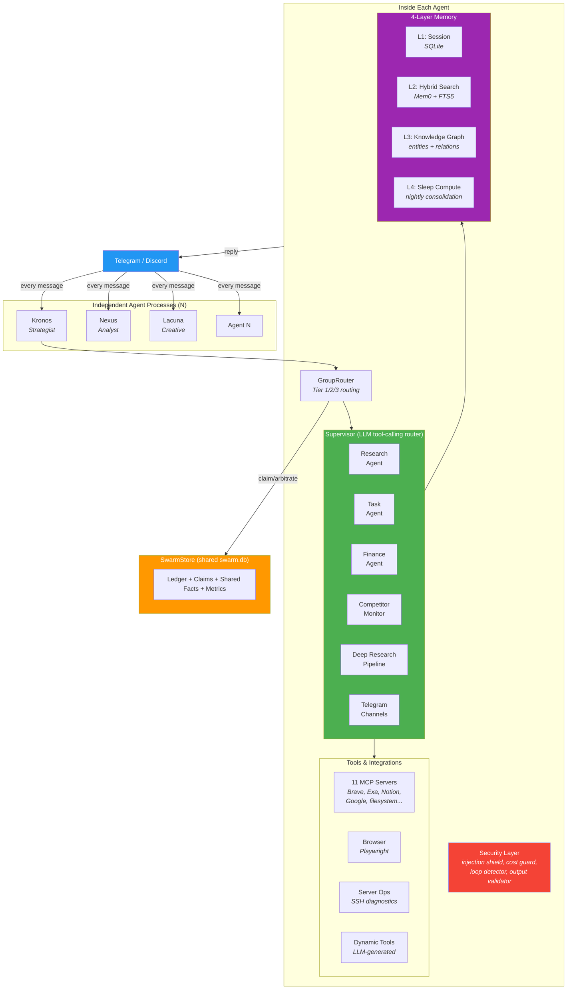

# Kronos Swarm

[](https://github.com/spyrae/kronos-swarm/actions/workflows/ci.yml)
[](https://www.python.org/downloads/)
[](LICENSE)

A full-featured multi-agent AI system. Each agent has its own persona, memory, skills, sub-agents, and tools -- and they coordinate autonomously in group chats via atomic SQLite arbitration.

**Not just chatbots in a group.** Each agent is a complete AI system with a supervisor that orchestrates chains of specialized sub-agents (research, finance, competitor analysis, task management), 11 MCP tool servers, 4-layer memory, browser automation, server ops, scheduled jobs, and a security layer. The swarm coordination in group chats is one capability, not the only one.

## What Makes This Different

| | Traditional Frameworks | Kronos Swarm |
|---|---|---|
| **Architecture** | Central orchestrator dispatches tasks | Independent processes, each a full agent |
| **Coordination** | Predefined handoff chains | Atomic SQLite arbitration, no Redis/pub-sub |
| **Routing** | Explicit: "send to agent X" | Implicit: agents decide relevance themselves |
| **Persona** | System prompt string | Three-Space architecture (identity + knowledge + ops) |
| **Memory** | Shared or none | Per-agent Mem0 + shared user facts via FTS5 |
| **Sub-agents** | Framework-specific | Supervisor with pluggable ReAct sub-agents |
| **Scaling** | Single process | N processes, one shared SQLite file |

## Architecture



## Features

### Agent Engine
- **Custom ReAct engine** -- 200 lines, no LangGraph, just `langchain_core`
- **Supervisor** -- LLM tool-calling router that dispatches to specialized sub-agents
- **Sub-agents** -- Research, Task (Notion/Calendar/Email), Finance, Competitor Monitor, Deep Research (multi-step pipeline), Topic Research, Telegram Channels
- **Skills system** -- progressive disclosure, self-improving skills, importable from external sources
- **Dynamic tools** -- agents can create new tools at runtime via LLM

### Swarm Coordination
- **Atomic SQLite arbitration** -- `reply_claims` with IMMEDIATE transactions, no Redis
- **Tier 1/2/3 routing** -- explicit @mention > topic relevance > peer reaction
- **Cross-agent addressing guard** -- "@nexus" message goes only to Nexus
- **Shared user facts** -- FTS5 cross-agent view of the user
- **Ephemeral peer reactions** -- agents react to each other without polluting history

### Memory (4 Layers)
- **L1** Session persistence (SQLite per-agent)
- **L2** Hybrid search: Mem0 vectors + FTS5 keywords with MMR re-ranking
- **L3** Knowledge graph: entities, relations, graph context injection
- **L4** Sleep-time compute: nightly entity extraction, insight generation, stale cleanup
- **Pluggable context engine** -- summarize / sliding window / hybrid strategies

### Tools & Integrations
- **11 MCP servers** -- Brave Search, Exa, Notion, Google Workspace (Gmail, Calendar), YouTube, Reddit, filesystem, Yahoo Finance, web fetch, content extraction, Markdown conversion
- **Browser automation** -- Playwright-based with URL security validation
- **Server ops** -- SSH-based diagnostics and management (configurable server registry)
- **Composio** -- 250+ third-party integrations (optional)

### Transport
- **Telegram** -- Telethon userbot (full message visibility in groups), Bot API for notifications
- **Discord** -- discord.py bridge (experimental)
- **Webhook server** -- HTTP endpoint for cron and external integrations
- **Voice** -- Groq Whisper STT for voice messages, Edge-TTS for voice responses

### Autonomous Operations (18 Cron Jobs)
- Heartbeat (health check every 30 min)
- Daily news monitor (Reddit, Twitter, web)
- Group chat digest (daily summary of monitored Telegram groups)
- Competitor monitoring (daily digest + weekly deep report + real-time alerts)
- Business analytics (11 data sources: Zabbix, Grafana, Sentry, Supabase, PostHog, RevenueCat, LiteLLM, Linear, Yandex Metrika, GA4, App Store)
- Expense tracking (Gmail parsing + Notion)
- User modeling (behavioral analysis, weekly pattern updates)
- Self-improvement (skill refinement, learning records)
- Sleep-time compute (memory consolidation, knowledge graph updates)
- Workspace backup

### Security
- Prompt injection shield (28 regex patterns, EN + RU)
- Output validator
- Cost guardian (per-request and daily limits)
- Loop detector (prevents infinite agent-to-agent chains)
- Browser URL allowlist

### Persona (Three-Space Architecture)
```
workspaces/<agent>/
  self/       -- WHO I AM (identity, soul, methodology, skills)
  notes/      -- WHAT I KNOW (user model, contacts, world knowledge)
  ops/        -- WHAT I DO (heartbeat, sessions, task queue, dynamic tools)
```
6 included agent personas with distinct cognitive profiles, communication styles, and domain expertise. Create your own from the template.

### Dashboard
- React UI for agent monitoring
- Memory inspector, skill manager, persona editor
- Performance metrics, audit trail, anomaly detection
- MCP server status, knowledge graph explorer

## Quickstart

### 1. Install

```bash
git clone https://github.com/spyrae/kronos-swarm.git
cd kronos-swarm

python3 -m venv .venv
source .venv/bin/activate
pip install -e ".[memory]"    # core + Mem0 + local embeddings
```

### 2. Configure

```bash
cp .env.example .env
cp agents.example.yaml agents.yaml
```

Edit `.env` -- minimum required:
```bash
FIREWORKS_API_KEY=fw_...      # or DEEPSEEK_API_KEY for lite-only mode
TG_API_ID=12345678            # from https://my.telegram.org
TG_API_HASH=abc123...
ALLOWED_USERS=                # your Telegram user ID
AGENT_NAME=kronos             # picks workspaces/kronos/
```

### 3. Create Telegram session

```bash
python scripts/auth-userbot.py
```

### 4. Run

```bash
python -m kronos
```

### Multi-Agent Setup

Each agent runs as a separate process:

```bash
AGENT_NAME=kronos python -m kronos    # Terminal 1
AGENT_NAME=nexus python -m kronos     # Terminal 2
AGENT_NAME=lacuna python -m kronos    # Terminal 3
```

Or use systemd units from `systemd/` for production, or `docker-compose.yml`.

### Docker

```bash
cp .env.example .env  # fill in values
docker compose up
```

## Adding a New Agent

1. `cp -r workspaces/_template workspaces/my-agent`
2. Edit `IDENTITY.md` and `SOUL.md` with your agent's persona
3. Add to `agents.yaml`:
   ```yaml
   my-agent:
     username: myagent_bot
     aliases: ["my agent"]
     role: "domain expert for X"
   ```
4. Create `.env.my-agent` with unique Telegram credentials
5. `AGENT_NAME=my-agent python -m kronos`

## Configuration

| File | Purpose |
|------|---------|
| `.env` | API keys and secrets (gitignored) |
| `agents.yaml` | Agent profiles: username, aliases, role for routing |
| `servers.yaml` | Server registry for SSH ops tools (gitignored) |
| `workspaces/<name>/` | Per-agent persona, knowledge, runtime state |
| `competitors.yaml` | Competitor list for monitoring |

See [`.env.example`](.env.example) for all environment variables with descriptions.

## Tech Stack

- **Engine**: Custom ReAct loop (`engine.py`) -- no LangGraph, no framework lock-in
- **LLM**: Kimi K2.5 (standard) / DeepSeek V3 (lite) via `langchain_core`
- **Memory**: Mem0 (Qdrant local) + SQLite FTS5 + Knowledge Graph
- **Coordination**: SQLite WAL mode with IMMEDIATE transactions
- **Transport**: Telethon (Telegram) + discord.py (Discord)
- **Tools**: `langchain-mcp-adapters` (11 MCP servers) + Playwright + asyncssh
- **Observability**: Langfuse (optional)
- **Dashboard**: FastAPI + React (Vite)

## Project Structure

```
kronos/
  engine.py             # Custom ReAct loop (200 lines)
  graph.py              # KronosAgent pipeline
  bridge.py             # Telegram transport + webhook server
  discord_bridge.py     # Discord transport
  group_router.py       # Tier-based swarm routing
  swarm_store.py        # Shared SQLite ledger + arbitration
  config.py             # Pydantic Settings
  persona.py            # System prompt builder from workspace
  agents/               # Supervisor + sub-agents
    supervisor.py       #   LLM tool-calling router
    research.py         #   Web research agent
    task.py             #   Notion/Calendar/Email agent
    finance.py          #   Finance agent
    competitor_monitor.py
    deep_research/      #   Multi-step research pipeline
    topic_research/     #   Topic discovery pipeline
    telegram_channels.py
    server_ops.py       #   SSH diagnostics agent
  memory/               # 4-layer memory system
    store.py            #   Mem0 integration
    fts.py              #   FTS5 keyword search
    hybrid.py           #   Vector + keyword merge
    knowledge_graph.py  #   Entity-relation graph
    context_engine.py   #   Pluggable compaction strategies
    compaction.py       #   LLM summarization
  tools/                # Tool integrations
    mcp_servers.py      #   11 MCP server configs
    browser/            #   Playwright automation
    server_ops.py       #   SSH tools (configurable registry)
    dynamic_tools.py    #   Runtime tool creation
    expense.py          #   Notion expense tracking + FIFO budget
    gateway.py          #   MCP gateway management
  security/             # Security layer
    shield.py           #   Prompt injection detection (28 patterns)
    cost_guardian.py    #   Spend limits
    loop_detector.py    #   Anti-loop for agent chains
    output_validator.py #   Response validation
  skills/               # Progressive skill system
  cron/                 # 18 scheduled jobs
  competitors/          # Competitor monitoring subsystem
  analytics/            # Business intelligence (11 data sources)
workspaces/
  _template/            # Skeleton for new agents
  kronos/               # Strategist (INTJ)
  nexus/                # Data Analyst
  lacuna/               # Creative Director
  resonant/             # UX Advocate
  keystone/             # Quality Engineer
  impulse/              # Action Catalyst
dashboard/              # FastAPI backend
dashboard-ui/           # React frontend (Vite)
systemd/                # Production systemd units
scripts/                # Ops: deploy, health check, backup
```

## Documentation

| Doc | Content |
|-----|---------|
| [ARCHITECTURE.md](docs/ARCHITECTURE.md) | System design and data flow |
| [MEMORY.md](docs/MEMORY.md) | 4-layer memory system in detail |
| [SECURITY.md](docs/SECURITY.md) | Security model and threat mitigation |
| [DEPLOYMENT.md](docs/DEPLOYMENT.md) | Production setup with systemd |
| [SKILLS.md](docs/SKILLS.md) | Skill system and progressive disclosure |
| [CRON-JOBS.md](docs/CRON-JOBS.md) | All 18 scheduled jobs |
| [CHANGELOG.md](CHANGELOG.md) | Release history |
| [CONTRIBUTING.md](CONTRIBUTING.md) | How to contribute |

## License

[Business Source License 1.1](LICENSE) -- free for personal, internal, academic, and integration use. Cannot be used to build a competing multi-agent swarm service. Converts to Apache 2.0 on 2030-04-26.
