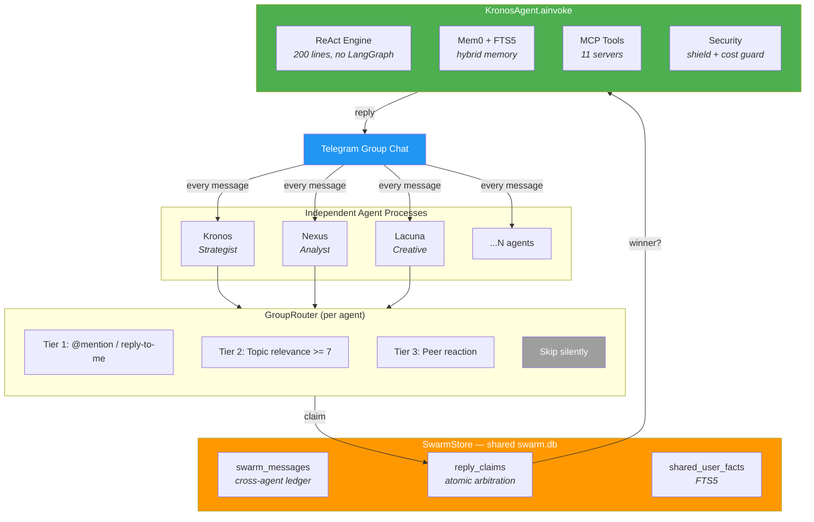

# Kronos Swarm

Multi-agent AI swarm for group chats. Independent processes, shared SQLite coordination, no orchestrator.

Each agent is a separate OS process with its own Telegram account, memory, and persona. Agents see every message in a group chat and independently decide whether to respond using tier-based routing and atomic claim arbitration.

**No Redis. No pub/sub. No central orchestrator. Just SQLite.**

## Why

Existing multi-agent frameworks (CrewAI, AutoGen, Agency Swarm) orchestrate task pipelines — one agent hands off to another in a predefined flow. They don't solve the problem of **multiple AI personalities coexisting in a group chat**, each deciding independently when to speak.

Kronos Swarm does:

- 6 agents see the same message simultaneously
- Each decides: "Is this for me? Do I have something valuable to add?"
- Atomic SQLite arbitration prevents duplicate replies
- Result: natural multi-expert conversation, not a pipeline

## Architecture



### Tier-Based Routing

| Tier | Trigger | Delay | Arbitration |
|------|---------|-------|-------------|
| **1** | @mention or reply-to-me | 1-5s | Bypasses cap -- always responds |
| **2** | Topic relevance >= 7 (LLM check) | 5-20s | Max 2 implicit replies per root message |
| **3** | Peer reaction (disagree with another agent) | 15-45s | Same cap + 5min cooldown |

### Claim Arbitration

Before sending, each agent inserts a `claimed` row into `swarm.db`, then runs an `IMMEDIATE` transaction to check if it's still the winner:

```
ORDER BY tier ASC, eta_ts ASC, agent_name ASC
```

Lowest tier wins. On tie, fastest ETA wins. On tie, alphabetical. Losers cancel silently.

## Key Components

| File | Lines | What it does |
|------|-------|-------------|
| `engine.py` | 205 | Custom ReAct loop -- replaces LangGraph entirely |
| `group_router.py` | 443 | Tier 1/2/3 routing + cross-agent addressing guard |
| `swarm_store.py` | 810 | Shared ledger, claim arbitration, user facts, metrics |
| `graph.py` | ~400 | KronosAgent pipeline: validate > memory > route > store |
| `bridge.py` | ~600 | Telethon userbot + webhook server |

## Features

- **Custom ReAct engine** -- 200 lines, no framework dependency, just `langchain_core`
- **Atomic SQLite arbitration** -- decentralized "who answers" without Redis
- **Three-Space persona** -- `self/` (identity) + `notes/` (knowledge) + `ops/` (runtime)
- **Hybrid memory** -- Mem0 vectors + FTS5 keywords + knowledge graph + sleep-time consolidation
- **Ephemeral peer reactions** -- agents react to each other without polluting history
- **11 MCP tool servers** -- Brave, Exa, Notion, Google Workspace, filesystem, and more
- **Built-in cron** -- 18 scheduled jobs (heartbeat, digests, analytics, competitor monitoring)
- **Security** -- prompt injection shield (28 patterns), output validator, cost guardian, loop detector
- **Pluggable context engine** -- summarize / sliding window / hybrid strategies

## Quickstart

### 1. Install

```bash
git clone https://github.com/spyrae/kronos-swarm.git
cd kronos-swarm

python3 -m venv .venv
source .venv/bin/activate
pip install -e "."            # core (no memory)
pip install -e ".[memory]"    # + Mem0 + local embeddings
```

### 2. Configure

```bash
cp .env.example .env
cp agents.example.yaml agents.yaml
```

Edit `.env` -- minimum required:
```bash
FIREWORKS_API_KEY=fw_...      # or DEEPSEEK_API_KEY for lite-only mode
TG_API_ID=12345678            # from https://my.telegram.org
TG_API_HASH=abc123...
ALLOWED_USERS=                # your Telegram user ID
AGENT_NAME=kronos             # picks workspaces/kronos/
```

### 3. Create Telegram session

```bash
python scripts/auth-userbot.py
# Follow the interactive login (phone number + code)
```

### 4. Run

```bash
python -m kronos
```

The agent connects to Telegram via Telethon userbot and starts listening.

### Multi-Agent Setup

Each agent runs as a separate process with its own `.env`:

```bash
# Terminal 1
AGENT_NAME=kronos python -m kronos

# Terminal 2
AGENT_NAME=nexus python -m kronos
```

Or use systemd units from `systemd/` for production deployment.

## Configuration

| File | Purpose |
|------|---------|
| `.env` | Secrets and API keys (gitignored) |
| `agents.yaml` | Agent profiles: username, aliases, role |
| `servers.yaml` | Server registry for SSH ops tools (gitignored) |
| `workspaces/<name>/` | Per-agent persona, knowledge, runtime state |

See [`.env.example`](.env.example) for all available environment variables.

## Adding a New Agent

1. Copy the workspace template:
   ```bash
   cp -r workspaces/_template workspaces/my-agent
   ```

2. Edit `workspaces/my-agent/self/IDENTITY.md` and `SOUL.md`

3. Add to `agents.yaml`:
   ```yaml
   my-agent:
     username: myagent_bot
     aliases: ["my agent"]
     role: "domain expert for X"
   ```

4. Create `.env.my-agent` with unique Telegram credentials

5. Run: `AGENT_NAME=my-agent python -m kronos`

## Tech Stack

- **Engine**: Custom ReAct loop (`engine.py` -- no LangGraph dependency)
- **LLM**: Kimi K2.5 (standard) / DeepSeek V3 (lite) via `langchain_core`
- **Memory**: Mem0 (Qdrant local) + SQLite FTS5 + Knowledge Graph
- **Coordination**: SQLite WAL mode with IMMEDIATE transactions
- **Transport**: Telethon userbot (Telegram) + Discord bridge (experimental)
- **MCP**: `langchain-mcp-adapters` with stdio transport
- **Observability**: Langfuse (optional)

## Project Structure

```
kronos/
  engine.py            # Custom ReAct loop
  graph.py             # KronosAgent pipeline
  bridge.py            # Telethon transport
  group_router.py      # Tier-based routing
  swarm_store.py       # Shared SQLite ledger
  config.py            # Pydantic Settings
  agents/              # Sub-agents (research, task, finance, competitor)
  memory/              # Mem0 + FTS5 + knowledge graph + context engine
  tools/               # MCP configs + custom tools
  security/            # Shield, loop detector, cost guardian
  cron/                # 18 scheduled jobs
workspaces/
  _template/           # Skeleton for new agents
  kronos/              # Chief of Staff persona
  nexus/               # Data Analyst persona
  ...                  # 4 more included personas
```

## Deployment

See [docs/DEPLOYMENT.md](docs/DEPLOYMENT.md) for production setup with systemd.

```bash
# Quick deploy via rsync
bash scripts/deploy.sh

# First-time setup
bash scripts/deploy.sh --first-run
```

## License

[Business Source License 1.1](LICENSE) — free for personal, internal, academic, and integration use. Cannot be used to build a competing multi-agent swarm service. Converts to Apache 2.0 on 2030-04-26.
