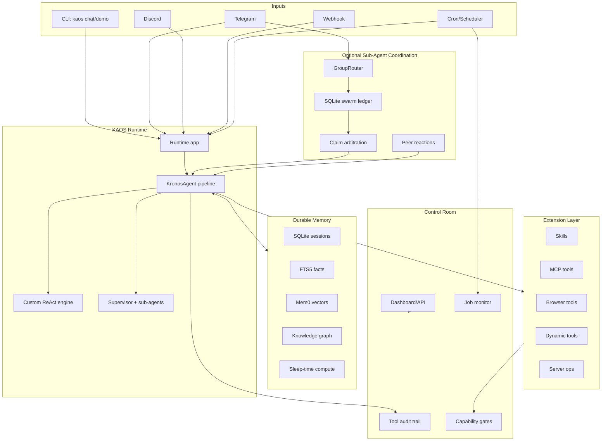

# Kronos Agent OS (KAOS) Architecture

KAOS is a self-hosted operating layer for durable AI agents. Multi-agent coordination is one optional module, not the whole system.

## System Map



## Runtime

The runtime accepts events from CLI, Telegram, Discord, webhooks, and scheduled jobs. All paths converge into `KronosAgent`, which owns validation, memory retrieval, routing, tool use, memory storage, and session persistence.

Key files:

- `kronos/app.py` - application startup and transport wiring.
- `kronos/cli.py` - `kaos doctor`, `kaos chat`, and safe demo mode.
- `kronos/graph.py` - main agent pipeline.
- `kronos/engine.py` - custom ReAct loop.
- `kronos/agents/supervisor.py` - specialist sub-agent routing.

## Memory

KAOS uses layered memory rather than only chat history:

- SQLite sessions keep conversation history by thread.
- FTS5 stores keyword-searchable facts and sessions.
- Mem0/Qdrant provides semantic recall when enabled.
- Knowledge graph stores entities and relations.
- Sleep-time compute consolidates facts and extracts graph structure.

Key files:

- `kronos/session.py`
- `kronos/memory/`
- `kronos/cron/sleep_compute.py`

## Skills

Skills are workspace-local procedures. The agent sees a small catalog in its prompt and can load full protocols or references only when needed.

Key files:

- `kronos/skills/store.py`
- `kronos/skills/tools.py`
- `workspaces/<agent>/self/skills/`

## Tool Gateway

The tool layer supports static MCP tools, custom tools, browser tools, Composio tools, dynamic tools, and optional server operations.

Public-safe defaults:

- Dynamic tool creation is disabled by default.
- Dynamic MCP add/remove/reload is disabled by default.
- Persisted dynamic MCP servers are not loaded by default.
- Server ops tools are disabled by default.
- Dynamic tools require Docker sandbox execution by default.

Key files:

- `kronos/tools/manager.py`
- `kronos/tools/gateway.py`
- `kronos/tools/gateway_tools.py`
- `kronos/tools/dynamic.py`
- `kronos/tools/sandbox.py`
- `kronos/tools/server_ops.py`

## Automations

Scheduled jobs call the same runtime and tools as interactive requests. This is what makes KAOS durable: it can produce digests, monitor changes, perform analytics, and run maintenance without waiting for a chat message.

Key files:

- `kronos/cron/scheduler.py`
- `kronos/cron/`

## Control Room

The dashboard is the operator surface for the Agent OS: memory, jobs, tool calls, capabilities, sessions, and coordination runs should be visible there.

Key files:

- `dashboard/`
- `dashboard-ui/`
- `kronos/audit.py`

## Sub-Agents And Swarm Mode

Swarm mode is the optional sub-agent coordination path. Each agent runs as an independent OS process with its own account, workspace, memory, and persona. In group chats, agents independently decide whether to respond, then use SQLite claim arbitration to prevent duplicate implicit replies.

Key files:

- `kronos/group_router.py`
- `kronos/swarm_store.py`
- `kronos/bridge.py`

## Capability Gates

The core launch posture is conservative. These env vars define whether risky surfaces are available:

```bash
ENABLE_DYNAMIC_TOOLS=false
REQUIRE_DYNAMIC_TOOL_SANDBOX=true
ENABLE_MCP_GATEWAY_MANAGEMENT=false
ENABLE_DYNAMIC_MCP_SERVERS=false
ENABLE_SERVER_OPS=false
```

This allows KAOS to remain useful as a local agent runtime while keeping infrastructure actions and runtime mutation explicit.
