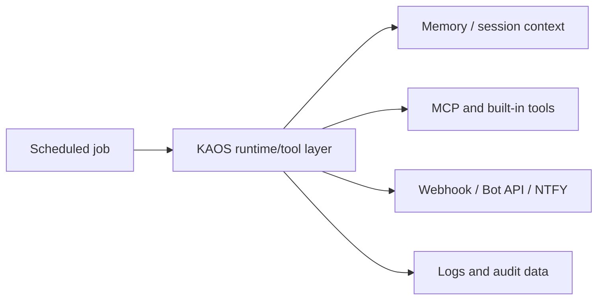

# Automations

Automations are scheduled jobs that call the same KAOS runtime, tools, memory,
and notification paths as interactive messages.

## Scheduler

KAOS uses a lightweight async scheduler in `kronos/cron/scheduler.py`.

Job types:

- periodic
- daily
- weekly

Jobs run as background tasks and should avoid blocking the main bridge loop.

## Runtime Integration

Automation jobs should call the same primitives as interactive work:

Jobs should pass an explicit job/session ID instead of borrowing a live user
chat thread. When a job writes user-visible output, it should also leave enough
log context to debug failures later.

## Dashboard Monitor

The dashboard reads `/api/monitoring/jobs` and `/api/monitoring/jobs/history`.
Each job exposes schedule, owner, capabilities, last run, next run, and safe
controls. Run history is persisted to `data/<agent>/logs/cron_runs.jsonl` with
status, duration, error text, and agent name.

Pause/resume changes the in-memory scheduler state. Manual trigger is allowlisted
for safe maintenance jobs such as `heartbeat` and `swarm-retention`; other jobs
remain scheduled-only to avoid accidental provider writes or notifications.

## What Jobs Should Do

Good automation jobs:

- daily brief
- monitored source digest
- health check
- memory consolidation
- release or issue summary
- recurring research scan

Avoid default-enabled jobs that require private accounts, production servers,
or user-specific data.

## Notifications

Notifications flow through `kronos/cron/notify.py`:

| Method | Use |
|--------|-----|
| Webhook | local bridge notifications |
| Bot API | Telegram topic messages when bot token exists |
| NTFY | optional push notifications |

Missing optional notification providers should not crash a job.

## Job Design Rules

- Read config from env/settings.
- Keep provider-specific behavior optional.
- Record useful audit/log events.
- Avoid writing outside the workspace/data directories.
- Keep destructive behavior behind explicit capability checks.
- Make failures visible but non-fatal to the main runtime.
- Use retries only around idempotent reads or clearly safe sends.
- Do not repeat a failed destructive action in a loop.
- Include the controlling capability gate in blocked-action messages.

## Examples

| Job | Behavior | Safety Notes |
|-----|----------|--------------|
| Daily brief | read sources, summarize, send notification | skip missing providers |
| Monitor | check known URLs/feeds/metrics, report changes | avoid noisy repeated alerts |
| Memory consolidation | extract graph entities and prune stale facts | local data only |
| Issue/release summary | read git/Linear/GitHub state and summarize | do not mutate by default |
| Health check | inspect local runtime/dashboard status | server ops stays opt-in |

For the detailed current job list, see [Cron Jobs](CRON-JOBS.md).
