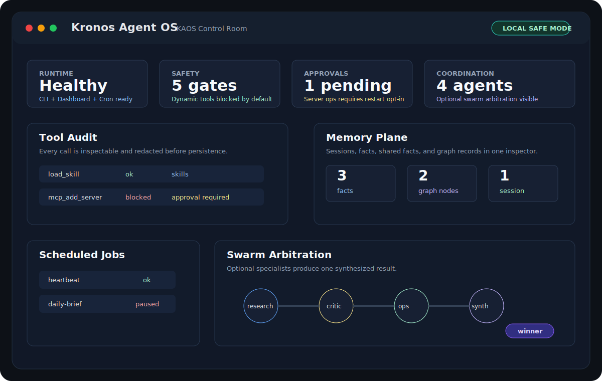

# Dashboard Control Room

The KAOS dashboard is the local control room for runtime status, memory, jobs, tool calls, skills, MCP configuration, and agent state.

## Safe Defaults

The dashboard is local-first by default:

```bash
DASHBOARD_HOST=127.0.0.1
DASHBOARD_PORT=8789
DASHBOARD_USERNAME=admin
DASHBOARD_PASSWORD=
```

If `DASHBOARD_PASSWORD` is empty, KAOS generates a temporary password at startup and logs it locally. There is no hardcoded default password.

## Local Access

Start the dashboard without Telegram or bridges:

```bash
kaos dashboard
```

Or run the full KAOS runtime and open:

```text
http://127.0.0.1:8789
```

Use `DASHBOARD_USERNAME` and the configured or generated password.

## Control Room Map

The dashboard is organized around runtime concerns rather than implementation files:

| View | Runtime Concern | Primary APIs |
|------|-----------------|--------------|
| Overview | Health, uptime, agent activity, anomalies | `/api/health`, `/api/overview/*`, `/api/anomalies/list` |
| Agents | Optional sub-agent registry and routing state | `/api/agents/*`, `/api/performance/agents` |
| Memory Explorer | Durable memories, manual memory add/search | `/api/memory/*` |
| Live Logs | Local runtime logs streamed over WebSocket | `/ws/logs` |
| Performance | Per-agent latency/request rollups | `/api/performance/agents` |
| Analytics | Cost and request history from audit logs | `/api/monitoring/*` |
| Audit Trail | Tool calls, runtime events, safety decisions | `/api/audit-trail/events` |
| Anomalies | Unusual runtime patterns from audit history | `/api/anomalies/list` |
| Swarm | Optional sub-agent arbitration visualizer | `/api/swarm/runs` |
| MCP Servers | Static/managed MCP server visibility | `/api/mcp/servers` |
| Skills | Workspace-local skill files and toggles | `/api/skills/*` |
| Graph | Runtime structure and supervisor graph | `/api/graph/*` |
| Persona | Agent identity and behavior files | `/api/persona/*` |
| Settings | Local config, provider state, and capability gates | `/api/config/*` |

CLI equivalents:

| Dashboard Concern | CLI / File Path |
|-------------------|-----------------|
| Health and setup | `kaos doctor` |
| Local chat session | `kaos chat` |
| Demo state | `kaos demo` |
| Dashboard screenshot fixtures | `kaos demo-seed --reset` |
| Agent workspace | `workspaces/<agent>/` |
| Docker dashboard | `docker compose up --build` |
| Runtime bridge | `python -m kronos` |

## Sessions, Approvals, And Tool Calls

Dashboard views should make runtime decisions inspectable:

- session/thread identity and recent activity
- tool calls and result status
- capability gates and blocked controls
- scheduled jobs and recent failures
- memory search/add/delete flows
- optional sub-agent coordination state

When a feature is blocked by policy, show the gate name instead of presenting a
dead control.

## Capability Model

The dashboard should reflect the same capability posture as the CLI:

- Dynamic tools are disabled unless `ENABLE_DYNAMIC_TOOLS=true`.
- Dynamic MCP server management is disabled unless `ENABLE_MCP_GATEWAY_MANAGEMENT=true`.
- Persisted dynamic MCP servers are ignored unless `ENABLE_DYNAMIC_MCP_SERVERS=true`.
- SSH/server operations are unavailable unless `ENABLE_SERVER_OPS=true` and `servers.yaml` exists.

When a control is blocked by policy, prefer showing the relevant env var rather than silently hiding the capability.

The Settings page reads `/api/config/capabilities` and shows each gate as
`enabled` or `blocked`, including the required env var for intentional opt-in.

## Remote Access

Do not bind the dashboard to a public interface unless you put it behind trusted network controls.

To expose intentionally:

```bash
DASHBOARD_HOST=0.0.0.0
DASHBOARD_PASSWORD=<strong unique password>
```

Recommended remote setup:

- Keep KAOS behind a private network, VPN, SSH tunnel, or authenticated reverse proxy.
- Use HTTPS at the proxy layer.
- Set a strong `DASHBOARD_PASSWORD`.
- Keep risky capability gates disabled unless the deployment is trusted.

Relevant gates:

```bash
ENABLE_DYNAMIC_TOOLS=false
ENABLE_MCP_GATEWAY_MANAGEMENT=false
ENABLE_DYNAMIC_MCP_SERVERS=false
ENABLE_SERVER_OPS=false
```

## Troubleshooting

- If the dashboard is unreachable, check `DASHBOARD_HOST` and `DASHBOARD_PORT`.
- If login fails after restart and no password was configured, use the newly generated password from local startup logs.
- If running in Docker, ensure the compose port mapping matches `DASHBOARD_PORT` and does not expose the service publicly unless intended.

## Screenshots

Canonical launch visual:



Generate local, repeatable dashboard fixture data before capturing refreshed
screenshots:

```bash
kaos demo-seed --reset
AGENT_NAME=demo DB_DIR=data/demo DB_PATH=data/demo/session.db SWARM_DB_PATH=data/demo/swarm.db WORKSPACE_PATH=workspaces/demo kaos dashboard
```

The same flow is available as a script:

```bash
python scripts/seed_demo_state.py --reset
```

Screenshot fixtures must remain public-safe. Do not include private workspace
names, tokens, Telegram IDs, production chats, or live memory content.
