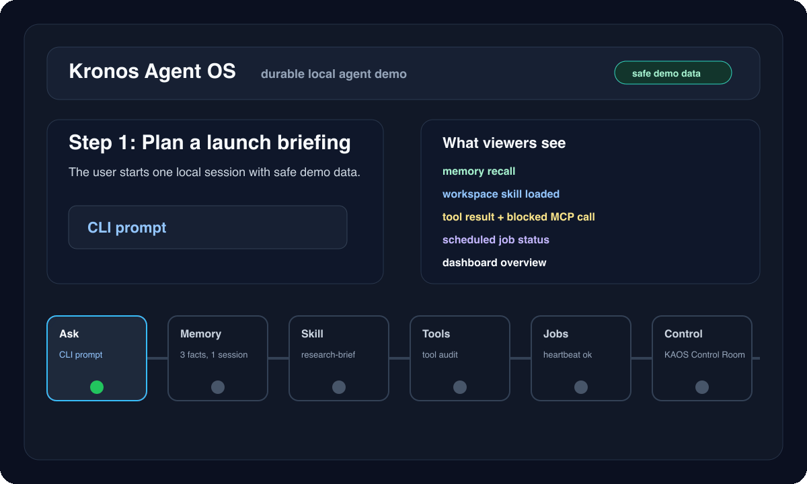

# KAOS Durable Agent Demo

This demo is the primary public proof for KAOS as an Agent OS: one local agent keeps state, recalls memory, loads a skill, audits tool calls, exposes scheduled job status, and makes the result inspectable in the dashboard.



## Reproduce Locally

```bash
kaos demo-seed --reset
AGENT_NAME=demo DB_DIR=data/demo DB_PATH=data/demo/session.db SWARM_DB_PATH=data/demo/swarm.db WORKSPACE_PATH=workspaces/demo kaos dashboard
```

Open the local dashboard and walk through:

1. Overview: runtime health, recent session, pending approval, memory, jobs, tool calls.
2. Memory: `demo-launch` session, facts, shared fact, and knowledge graph records.
3. Audit Trail: `load_skill` succeeds and `mcp_add_server` is blocked by policy.
4. Monitoring: `heartbeat` has a successful run; demo daily brief is paused/failed safely.
5. Config: capability approvals show that dangerous gates require explicit restart opt-in.
6. Swarm: optional coordination visualizer shows roles and final synthesis.

## 60-120 Second Script

| Time | Scene | Narration |
|------|-------|-----------|
| 0-10s | CLI seed | "KAOS starts from deterministic safe demo state, no private chats or tokens." |
| 10-25s | Overview | "The control room shows the whole agent OS: runtime, memory, jobs, tools, approvals, and coordination." |
| 25-40s | Memory | "The agent is durable: it remembers launch preferences and exposes what can be recalled." |
| 40-55s | Skill | "Behavior is packaged as a workspace skill, so reusable workflows are reviewable files." |
| 55-75s | Audit Trail | "Every tool lifecycle event is logged. Risky MCP mutation is blocked by default." |
| 75-95s | Jobs | "Scheduled jobs use the same runtime and are visible with last run, status, and failure reason." |
| 95-120s | Swarm / close | "Sub-agent coordination is optional. KAOS is the operating layer around memory, skills, tools, jobs, dashboard, and swarm." |

## Assets

- Storyboard SVG: `docs/assets/kaos-durable-agent-demo.svg`
- Animated GIF: `docs/assets/kaos-durable-agent-demo.gif`
- Control room visual: `docs/assets/kaos-dashboard-control-room.svg`

Regenerate the storyboard and GIF:

```bash
python scripts/render_demo_assets.py
```

The GIF render requires `rsvg-convert` and `ffmpeg`. If either is missing, the script still refreshes the SVG storyboard.
