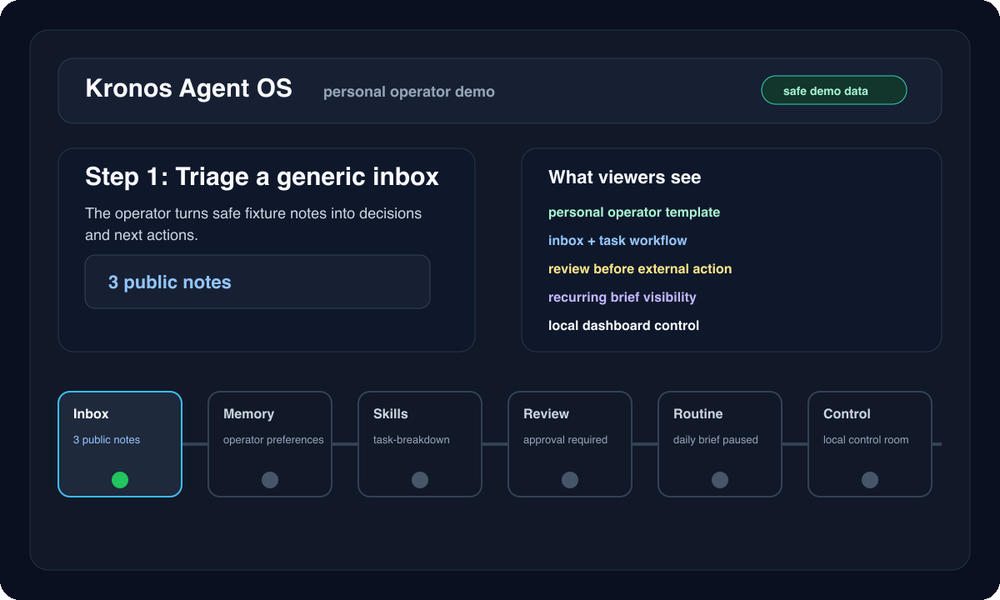

# KAOS Personal Operator Demo

This demo shows the most relatable KAOS use case: a local personal operator that turns a small inbox of safe fixture notes into a plan, recalls durable preferences, uses task/research skills, and keeps risky actions behind review.



## Reproduce Locally

```bash
kaos demo-seed --data-dir data/personal-demo --workspace workspaces/personal-demo --swarm-db data/personal-demo/swarm.db --reset
kaos templates install personal-operator personal-demo --force
kaos skills install-pack research --agent personal-demo --force
kaos skills install-pack productivity --agent personal-demo --force
AGENT_NAME=personal-demo DB_DIR=data/personal-demo DB_PATH=data/personal-demo/session.db SWARM_DB_PATH=data/personal-demo/swarm.db WORKSPACE_PATH=workspaces/personal-demo kaos dashboard
```

The demo uses only generic launch/inbox fixtures. It does not require Telegram, private accounts, email access, live calendars, or real personal data.

## Demo Flow

| Time | Scene | What It Proves |
|------|-------|----------------|
| 0-10s | Install template | Personal Operator is a first-class KAOS template, not a custom private setup. |
| 10-25s | Seed safe inbox state | The operator starts from reproducible local fixture data. |
| 25-45s | Memory inspector | It remembers durable preferences and recurring project context. |
| 45-65s | Skills | `research-brief` and `task-breakdown` turn rough notes into a useful plan. |
| 65-85s | Approval queue | External messaging/tool mutation remains blocked until explicitly enabled. |
| 85-105s | Jobs | A recurring brief can be monitored without hiding automation. |
| 105-120s | Control room | Dashboard ties sessions, memory, jobs, audit, and capability gates together. |

## Example Prompt

```text
I have three safe fixture notes: a launch reminder, a research question, and a follow-up task.
Turn them into a concise operator brief with decisions, risks, and next actions.
Do not send messages or mutate external systems.
```

## Assets

- Storyboard SVG: `docs/assets/kaos-personal-operator-demo.svg`
- Animated GIF: `docs/assets/kaos-personal-operator-demo.gif`
- Template metadata: `templates/agents/personal-operator/template.yaml`

Regenerate the assets:

```bash
python scripts/render_demo_assets.py
```
