# KAOS Runtime

The runtime is the shared execution layer behind CLI, Telegram, Discord,
webhook/cron, and dashboard-triggered work.

## Entry Points

| Entry Point | Purpose |
|-------------|---------|
| `kaos demo` | offline walkthrough, no provider keys required |
| `kaos chat` | interactive local chat |
| `kaos chat --prompt "..."` | one-shot local message |
| `python -m kronos` | long-running runtime with bridges, scheduler, dashboard |
| Telegram bridge | userbot/Bot API conversation transport |
| Webhook | local automation and cron notifications |
| Discord bridge | optional experimental transport |

## Lifecycle

1. Load settings from environment.
2. Prepare data directories.
3. Create `SessionStore` for persistent conversation history.
4. Load static MCP tools when configured.
5. Construct `KronosAgent`.
6. Start bridges, scheduler, and dashboard.
7. Process each message through validation, memory, routing, tools, response, and persistence.

## Message Flow

```mermaid
flowchart LR
    IN["CLI / Telegram / Discord / Cron / Webhook"] --> VALIDATE["Input validation"]
    VALIDATE --> HISTORY["Session history"]
    HISTORY --> MEMORY["Memory retrieval"]
    MEMORY --> ROUTE["KronosAgent routing"]
    ROUTE --> TOOLS["Tool gateway / sub-agents"]
    TOOLS --> MODEL["LLM response"]
    MODEL --> STORE["Session + memory persistence"]
    STORE --> AUDIT["Logs / audit / dashboard"]
```



The transport layer should stay thin. It normalizes the incoming event into a
message, thread ID, user ID, session ID, and optional transient system context.
`KronosAgent` owns the actual runtime behavior.

## Sessions

Session scope is transport-specific:

| Source | Thread ID |
|--------|-----------|
| CLI | fixed local thread unless overridden |
| Telegram DM | chat ID |
| Telegram topic | chat ID + topic ID |
| Discord channel/thread | Discord IDs |
| Cron/webhook | configured task/session ID |

Peer reactions and transient group metadata should not be persisted into the
main user session.

## User, Workspace, And Data Boundaries

| Boundary | Purpose |
|----------|---------|
| `AGENT_NAME` | selects the local workspace and per-agent data directory |
| `workspaces/<agent>/` | persona, skills, notes, and local operator files |
| `data/<agent>/session.db` | conversation history for that agent |
| `data/<agent>/memory_fts.db` | local keyword memory index |
| `data/<agent>/knowledge_graph.db` | local entity/relation memory |
| `data/<agent>/qdrant/` | optional local vector memory store |
| `data/swarm.db` | shared cross-agent coordination ledger |

Live workspaces and data files can contain private user state and should remain
gitignored. Public templates belong in `workspaces/_template/`.

## CLI Behavior

`kaos demo` is deterministic and safe for quickstart.

`kaos chat` requires `FIREWORKS_API_KEY` or `DEEPSEEK_API_KEY`.

The CLI uses the same `KronosAgent`, session store, memory flags, and tool
gateway as the long-running runtime. Tool calls are printed as compact terminal
events such as:

```text
[approval] {"dynamic-mcp": "off", "dynamic-tools": "off", "memory": "on", "server-ops": "off", "tools": 6}
[tool] session_search args={"query": "last launch decision"}
[tool:ok] session_search Found 2 matching sessions
```

Secret-like tool args are redacted before printing.

Use `--no-memory` when debugging provider/runtime behavior without initializing
the long-term memory stack:

```bash
kaos chat --prompt "summarize KAOS" --no-memory
```

## Failure Principles

- Missing optional providers should degrade gracefully.
- Missing runtime LLM keys should point to `kaos demo`.
- Risky capabilities should fail closed with the controlling env var named.
- Background memory/tool failures should not crash the primary message path.
- Tool/audit/log output should avoid printing secrets or live private state.

## Minimal Extension Example

To add a low-risk runtime extension, prefer a narrow tool or skill before
changing the core agent loop.

Example path:

1. Add a small tool under `kronos/tools/`.
2. Register it in the relevant tool manager only when prerequisites exist.
3. Add a capability gate if the tool can mutate files, network state, money, or infrastructure.
4. Add a CLI/docs example and a test that proves missing config degrades cleanly.

If the behavior is only instructions and references, make it a skill instead of
a Python tool.
