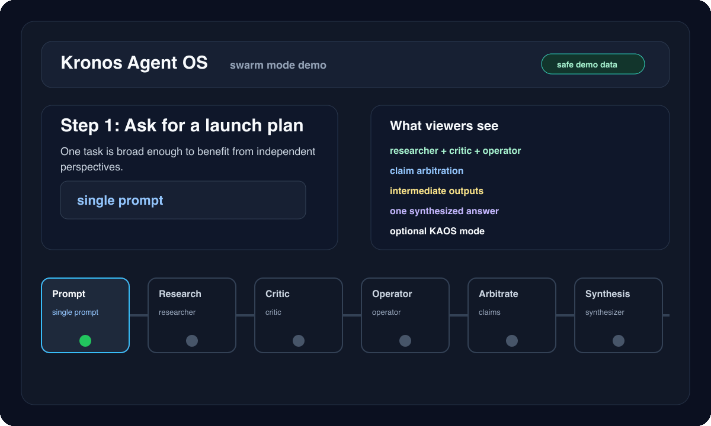

# KAOS Swarm Mode Demo

This demo shows swarm as an optional KAOS coordination mode. The point is not "many agents for everything"; it is role specialization when one broad task benefits from independent research, critique, operations, and synthesis.



## Reproduce Locally

```bash
kaos demo-seed --reset
AGENT_NAME=demo DB_DIR=data/demo DB_PATH=data/demo/session.db SWARM_DB_PATH=data/demo/swarm.db WORKSPACE_PATH=workspaces/demo kaos dashboard
```

Open `/swarm` in the dashboard. The seed state includes one safe launch-planning run with four roles, intermediate steps, claim status, final synthesis, and coordination metrics.

## Demo Prompt

```text
Plan a public KAOS launch.
Split the work across researcher, critic, operator, and synthesizer roles.
Show the strongest useful disagreement, then return one final plan.
```

## Roles

| Role | Output |
|------|--------|
| Researcher | Finds comparable open-source launch patterns and examples. |
| Critic | Finds setup, safety, and positioning risks. |
| Operator | Converts the decision into commands, docs, assets, and checks. |
| Synthesizer | Produces one final answer and calls out unresolved tradeoffs. |

## 60-90 Second Script

| Time | Scene | What It Shows |
|------|-------|---------------|
| 0-10s | Prompt | One broad task enters the normal KAOS runtime. |
| 10-25s | Roles | Researcher, critic, operator, and synthesizer each claim a useful angle. |
| 25-45s | Intermediate outputs | The dashboard shows role-specific work instead of opaque parallel calls. |
| 45-60s | Arbitration | Reply claims and metrics make coordination visible. |
| 60-75s | Final synthesis | The synthesizer returns one answer, not four competing replies. |
| 75-90s | Framing | Swarm is optional; simple tasks should stay single-agent. |

## When To Use It

Use swarm mode for research synthesis, launch planning, incident review, and product strategy tradeoffs.

Use a single agent for quick answers, simple edits, deterministic local tasks, and anything where parallel roles add cost without clarity.

## Assets

- Storyboard SVG: `docs/assets/kaos-swarm-mode-demo.svg`
- Animated GIF: `docs/assets/kaos-swarm-mode-demo.gif`
- Dashboard route: `/swarm`
- Seed state: `kaos demo-seed --reset`

Regenerate the media:

```bash
python scripts/render_demo_assets.py
```
